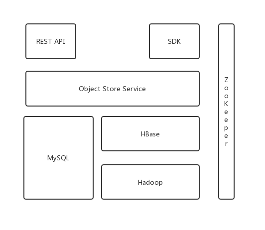

# ObjectStoreService
基于HBase实现的对象存储服务

## 技术选型
- 基于Spring Boot框架构建Service
- 存储采用HBase
- 服务本身支持分布式，通过zookeeper实现分布式锁，来保证分布式服务能够正常运行
- 对外提供Restful API和SDK供用户使用

## 架构

## v1.0功能概览
- 用户管理
- 权限管理

## 模块划分
- oss-core
- oss-mybatis

